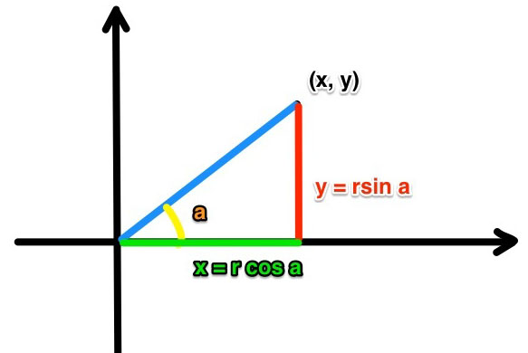

##AffineTransform（仿射变换）
一个任意的仿射变换都能表示为 乘以一个矩阵 (线性变换) 接着再 加上一个向量 (平移)。
我们能够用仿射变换来表示:

* 旋转 (线性变换)
* 平移 (向量加)
* 缩放操作 (线性变换)

我们通常使用 2 x 3 矩阵来表示仿射变换(以下需要一些线性代数的知识)。
$$
A = \begin{bmatrix}
 a & c  \\\\
 b & d  \\\\ 
\end{bmatrix}\_{2 \times 2}
, 
\quad
B = \begin{bmatrix}
 t\_x  \\\\
 t\_y  \\\\ 
\end{bmatrix}\_{2 \times 1}
\\\\
\\\\ 
M = \begin{bmatrix}
 A  \\\\
 B  \\\\ 
\end{bmatrix} = \begin{bmatrix}
 a & c & t\_x \\\\
 b & d & t\_y \\\\ 
\end{bmatrix}\_{2 \times 3}
$$

用矩阵A和B对二维向量X做变换，那上式也可表示为
$$
T = A \cdot \begin{bmatrix}
 x  \\\\
 y  \\\\ 
\end{bmatrix} + B \quad 或 \quad T = M \cdot \begin{bmatrix}
 x & y & 1 
\end{bmatrix}^T
\\\\ 
\\\\ 
T = \begin{bmatrix}
 ax + cy + t\_x  \\\\
 bx + dy + t\_y  \\\\ 
\end{bmatrix}
$$

[单位矩阵](http://zh.wikipedia.org/zh/%E5%96%AE%E4%BD%8D%E7%9F%A9%E9%99%A3)，主对角线为1，其他都为0的矩阵
$$
\begin{bmatrix}
 1 & 0 & \cdots & 0 \\\\
 0 & 1 &  & \vdots \\\\ 
 \vdots &  & \ddots & \vdots \\\\ 
 0 & \cdots & \cdots & 1
\end{bmatrix}
$$

##CGAffineTransform官方定义

```objc
struct CGAffineTransform {
	CGFloat a, b, c, d;
	CGFloat tx, ty;
};
```

虽然结构体中只有`a`,`b`,`c`,`d`,`tx`,`ty` 6个参数，但其实还有3个固定的参数[0,0,1]来组成3x3的矩阵。

仿射变换表示为一个3x3的矩阵如下:
$$
\begin{bmatrix}
 a & b & 0 \\\\
 c & d & 0 \\\\ 
 t\_x & t\_y & 1 
\end{bmatrix}
$$

对于一个`CGPoint`(x, y), 经过以上仿射变换后为（x’, y’）,可表示为
$$
\begin{bmatrix} x' & y' & 1 \end{bmatrix} = \begin{bmatrix} x & y & 1 \end{bmatrix} \times \begin{bmatrix}
 a & b & 0 \\\\
 c & d & 0 \\\\ 
 t\_x & t\_y & 1 
\end{bmatrix}
$$

即公式(1):
$$
\label{exampleone}
x’ = ax + cy + t\_x  \\\\
y’ = bx + dy + t\_y
$$

##identity矩阵
```objc
/* The identity transform: [ 1 0 0 1 0 0 ]. */
CG_EXTERN const CGAffineTransform CGAffineTransformIdentity
  CG_AVAILABLE_STARTING(__MAC_10_0, __IPHONE_2_0);
```
identity矩阵可以表示为
$$
\begin{bmatrix}
 1 & 0 & 0 \\\\
 0 & 1 & 0 \\\\ 
 0 & 0 & 1 
\end{bmatrix}
$$
代入公式（1），的得到
$$
x’ = 1x + 0y + 0 \\\\
y’ = 0x + 1y + 0
$$
整理后得到
$$
x’ = x \\\\
y’ = y
$$

**identity仿射矩阵计算后的坐标也就是坐标自己本身。**

##CGAffineTransformMakeTranslation方法

```objc
/* Return a transform which translates by `(tx, ty)':
     t' = [ 1 0 0 1 tx ty ] */

CG_EXTERN CGAffineTransform CGAffineTransformMakeTranslation(CGFloat tx,
  CGFloat ty) CG_AVAILABLE_STARTING(__MAC_10_0, __IPHONE_2_0);
```
`CGAffineTransformMakeTranslation`是一个进行平移的方法，根据注释得到的矩阵为
$$
\begin{bmatrix}
 1 & 0 & 0 \\\\
 0 & 1 & 0 \\\\ 
 t\_x & t\_y & 1 
\end{bmatrix}
$$
代入公式（1），的得到
$$
x’ = 1x + 0y + t\_x \\\\
y’ = 0x + 1y + t\_y
$$
整理后得到
$$
x’ = x + t\_x \\\\
y’ = y + t\_y
$$

**`CGAffineTransformMakeTranslation`也就是所对原来坐标进行一个平移的操作，在x轴方向上移动tx，在y轴方向上移动ty。**

##CGAffineTransformMakeScale方法

```objc
/* Return a transform which scales by `(sx, sy)':
     t' = [ sx 0 0 sy 0 0 ] */

CG_EXTERN CGAffineTransform CGAffineTransformMakeScale(CGFloat sx, CGFloat sy)
  CG_AVAILABLE_STARTING(__MAC_10_0, __IPHONE_2_0);
```
`CGAffineTransformMakeScale`是一个进行缩放的方法，根据注释得到的矩阵为
$$
\begin{bmatrix}
 s\_x & 0 & 0 \\\\
 0 & s\_y & 0 \\\\ 
 0 & 0 & 1 
\end{bmatrix}
$$
代入公式（1），的得到
$$
x’ = s\_xx + 0y + 0 \\\\
y’ = 0x + s\_xy + 0
$$
整理后得到
$$
x’ = s\_xx \\\\
y’ = s\_yy 
$$

**`CGAffineTransformMakeScale`方法在x轴上缩放sx，在y轴上缩放sx**

##CGAffineTransformMakeRotation方法

```objc
/* Return a transform which rotates by `angle' radians:
     t' = [ cos(angle) sin(angle) -sin(angle) cos(angle) 0 0 ] */

CG_EXTERN CGAffineTransform CGAffineTransformMakeRotation(CGFloat angle)
  CG_AVAILABLE_STARTING(__MAC_10_0, __IPHONE_2_0);
```
`CGAffineTransformMakeRotation`是一个进行旋转的方法，根据注释得到的矩阵为
$$
\begin{bmatrix}
 \cos\alpha & \sin\alpha & 0 \\\\
 -\sin\alpha & \cos\alpha & 0 \\\\ 
 0 & 0 & 1 
\end{bmatrix}
$$

####1、证明x'和y'构成圆方程
代入公式（1），的得到
$$
x’ = \cos\alpha x - \sin\alpha y + 0 \\\\
y’ = \sin\alpha x + \cos\alpha y + 0
$$
整理后得到
$$
x’ = \cos\alpha x - \sin\alpha y \\\\
y’ = \sin\alpha x + \cos\alpha y 
$$
两边都平方，得到
$$
(x’)^2 = \cos^2\alpha x^2 - 2\sin\cos\alpha + \sin^2\alpha y^2 \\\\
(y’)^2 = \sin^2\alpha x^2 + 2\sin\cos\alpha + \cos^2\alpha y^2 
$$
两式左右都相加得到
$$
(x’)^2 + (y’)^2 = (\cos^2\alpha + \sin^2\alpha)x^2 + (2\sin\cos\alpha- 2\sin\cos\alpha)+ (\sin^2\alpha + \cos^2\alpha)y^2  \\\\
$$

化简后得到
$$
(x’)^2 + (y’)^2 = x^2 + y^2 = r^2
$$

直接就是圆的方程，这只是证明x’ 与 y’在变换后任然在与x 和 y 在以(0,0)为圆心的圆上。

####2、真正的推导过程


根据上图用三角函数表示公式(1)
$$
\label{exampletwo}
\begin{align} 
x &= r \cos \theta \\\\
y &= r \sin \theta \\\\\\\\
&逆时针旋转\alpha后\\\\\\\\
x' &= r \cos (\theta + \alpha) \\\\
 &= r \cos\theta \cos\alpha - r \sin\theta \sin\alpha \\\\\\\\
 &将(2)式代入 \\\\\\\\
 &= \cos\alpha x - \sin\alpha y \\\\\\\\
y' &= r \sin (\theta + \alpha) \\\\
 &= r \sin\theta \cos\alpha + r \cos\theta \sin\alpha \\\\\\\\
 &将(2)式代入 \\\\\\\\
 &= \sin\alpha x + \cos\alpha y
\end{align}
$$


**`CGAffineTransformMakeRotation`方法用来计算出原来点(x,y)旋转α°之后的(x',y')，即将原来的旋转α°。**

##胡乱吐槽
数学真的是很奇妙的东西，矩阵虽然不明白这是如何抽象出来的，但是觉得很厉害的样子。Google了一些资料，还是云里雾里的，只能感叹其中的精妙了。

以下摘自[理解矩阵](http://blog.csdn.net/myan/article/details/647511)

>这样的一类问题，经常让使用线性代数已经很多年的人都感到为难。就好像大人面对小孩子的刨根问底，最后总会迫不得已地说“就这样吧，到此为止”一样，面对这样的问题，很多老手们最后也只能用：“就是这么规定的，你接受并且记住就好”来搪塞。然而，这样的问题如果不能获得回答，线性代数对于我们来说就是一个粗暴的、不讲道理的、莫名其妙的规则集合，我们会感到，自己并不是在学习一门学问，而是被不由分说地“抛到”一个强制的世界中，只是在考试的皮鞭挥舞之下被迫赶路，全然无法领略其中的美妙、和谐与统一。直到多年以后，我们已经发觉这门学问如此的有用，却仍然会非常迷惑：怎么这么凑巧？

>我认为，这是我们的线性代数教学中直觉性丧失的后果。上述这些涉及到“如何能”、“怎么会”的问题，仅仅通过纯粹的数学证明来回答，是不能令提问者满意的。比如，如果你通过一般的证明方法论证了矩阵分块运算确实可行，那么这并不能够让提问者的疑惑得到解决。他们真正的困惑是：矩阵分块运算为什么竟然是可行的？究竟只是凑巧，还是说这是由矩阵这种对象的某种本质所必然决定的？如果是后者，那么矩阵的这些本质是什么？只要对上述那些问题稍加考虑，我们就会发现，所有这些问题都不是单纯依靠数学证明所能够解决的。像我们的教科书那样，凡事用数学证明，最后培养出来的学生，只能熟练地使用工具，却欠缺真正意义上的理解。

>自从1930年代法国布尔巴基学派兴起以来，数学的公理化、系统性描述已经获得巨大的成功，这使得我们接受的数学教育在严谨性上大大提高。然而数学公理化的一个备受争议的副作用，就是一般数学教育中直觉性的丧失。数学家们似乎认为直觉性与抽象性是矛盾的，因此毫不犹豫地牺牲掉前者。然而包括我本人在内的很多人都对此表示怀疑，我们不认为直觉性与抽象性一定相互矛盾，特别是在数学教育中和数学教材中，帮助学生建立直觉，有助于它们理解那些抽象的概念，进而理解数学的本质。反之，如果一味注重形式上的严格性，学生就好像被迫进行钻火圈表演的小白鼠一样，变成枯燥的规则的奴隶。。


-以上-
