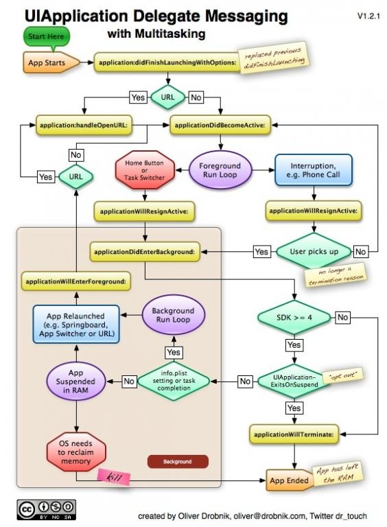
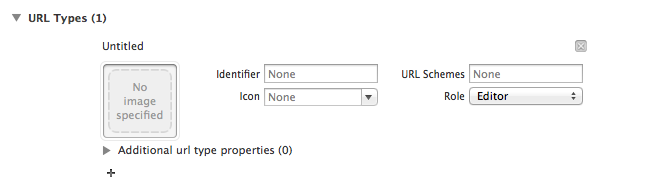
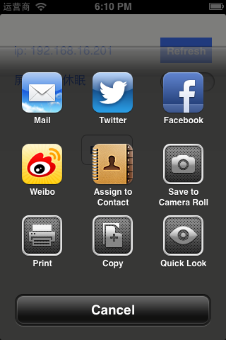

iOS中打开App的方法并不是只有点击App图标这一种，所以下面来看下具体有哪些方法，先上[官方文档LaunchOptionsKeys](https://developer.apple.com/library/ios/documentation/uikit/reference/UIApplicationDelegate_Protocol/Reference/Reference.html)

###打开方式分类
* [点击桌面图标打开](#点击桌面图标打开)
* [通过openurl打开](#通过openurl打开)
* [点击远程推送（remotenotification）打开](#点击远程推送（remotenotification）打开)
* [通过本地推送（localnotification）打开](#通过本地推送（localnotification）打开)
* [通过其他程序的UIDocumenInteractionController点击后打开](#通过其他程序的UIDocumenInteractionController点击后打开)
* [其他方式](#其他方式)

###如何在程序中获取到打开方式

```objc
// main.m
#import "AppDelegate.h"

int main(int argc, char * argv[])
{
	@autoreleasepool {
		return UIApplicationMain(argc, argv, nil, NSStringFromClass([AppDelegate class]));
	}
}
```

首先得先说下程序的iOS程序的启动流程,每个c程序都是以`main`作为程序的程序的入口，objective-c也不例外。在`main`函数中调用了`UIApplicationMain(argc, argv, nil, NSStringFromClass([AppDelegate class]));`将程序的控制权交给`AppDelegate`，iOS生命周期交给`AppDelegate`来控制。  

具体看下图（有图有真相）。


几乎每次启动都会调用`application: didFinishLaunchingWithOptions:`(PS:有例外，比如App已经在后台，此时再启动App时是不会调用的。)

可以通过`launchOptions`来判断具体是哪种方式启动

```objc
- (BOOL)application:(UIApplication *)application didFinishLaunchingWithOptions:(NSDictionary *)launchOptions
```

###<a id="点击桌面图标打开"></a>点击桌面图标打开

`launchOptions`返回为空。

```
Sep  9 10:58:12 Xummers-iPhone HandleOpenUrlDemo[50430] <Warning>: launchOptions (null) 
```

###<a id="通过openurl打开"></a>通过openurl打开

`UIApplicationLaunchOptionsSourceApplicationKey`为调用`openurl`打开的源程序的bundle id。   
`UIApplicationLaunchOptionsURLKey` 为`openurl`所传的参数，如果app有多个url schema时可以在这里做判断。

```
launchOptions {
		UIApplicationLaunchOptionsSourceApplicationKey = "com.apple.mobilesafari";
		UIApplicationLaunchOptionsURLKey = "openapptest://";
}
```



###<a id="点击远程推送（remotenotification）打开"></a>点击远程推送（remotenotification）打开
`UIApplicationLaunchOptionsRemoteNotificationKey` 直接是一个推送的json内容。

```
Sep  9 10:49:51 Xummers-iPhone HandleOpenUrlDemo[50363] <Warning>: launchOptions {
	UIApplicationLaunchOptionsRemoteNotificationKey =     {
		 aps =         {
				alert = test;
				badge = 1;
				sound = default;
             };
        };
     }
```
###<a id="通过本地推送（localnotification）打开"></a>通过本地推送（localnotification）打开
`UIApplicationLaunchOptionsLocalNotificationKey`为本地推送的内容。

```
launchOptions {
         UIApplicationLaunchOptionsLocalNotificationKey = "<UIConcreteLocalNotification: 0x1e5c8b60>{fire date = 2013\U5e749\U67089\U65e5\U661f\U671f\U4e00 \U4e2d\U56fd\U6807\U51c6\U65f6\U95f411\U65f613\U520655\U79d2, time zone = Asia/Shanghai (GMT+0800) offset 28800, repeat interval = 0, repeat count = UILocalNotificationInfiniteRepeatCount, next fire date = (null), user info = (null)}";
     }
```

###<a id="通过其他程序的UIDocumenInteractionController点击后打开"></a>通过其他程序的UIDocumenInteractionController点击后打开
`UIApplicationLaunchOptionsSourceApplicationKey`为打开的源程序的bundle id。
`UIApplicationLaunchOptionsURLKey` 需要被打开具体文件路径

```
launchOptions {
         UIApplicationLaunchOptionsSourceApplicationKey = "Xummer.X-SSH";
         UIApplicationLaunchOptionsURLKey = "file://localhost/private/var/mobile/Applications/BEEA17E6-0EAA-4F52-A3A0-E7E0693BC586/Documents/Inbox/gintama.jpeg";
     }
```


###<a id="其他方式"></a>其他方式
其他key还有`UIApplicationLaunchOptionsAnnotationKey`,`UIApplicationLaunchOptionsLocationKey`,
`UIApplicationLaunchOptionsNewsstandDownloadsKey`。  
因为没有用到过，所以想知道这些key的内容还是看[Apple的文档](https://developer.apple.com/library/ios/documentation/uikit/reference/UIApplicationDelegate_Protocol/Reference/Reference.html)吧。

-以上-
