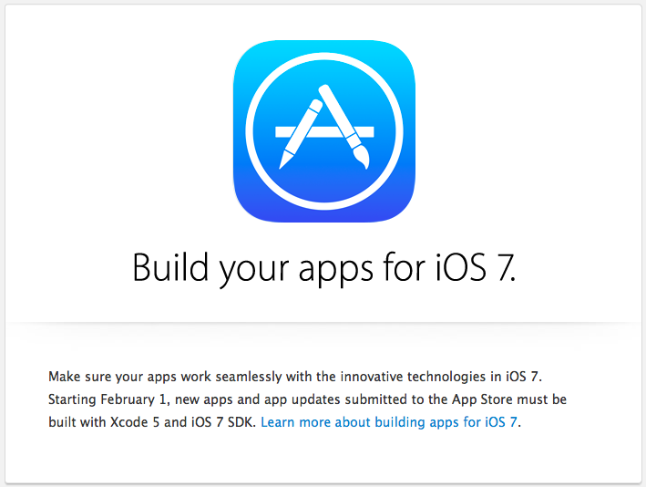

iOS 7 和 Xcode 5 发布也有一段时间了，各种程序也已经开始做 iOS 7的适配了，这也是挺头疼的一件事，Statuebar 的 20px 就让人蛋疼无比，请允许我做一个悲伤的表情。。。

之前的程序为了做 20 个像素比较蛋疼，并不是一两句代码可以搞定的。Stack overflow 上有一些适配这 20 像素的方法，感觉不够优雅，会有很多问题。还好苹果留了一手，其实最简单是适配就是不做适配。。。 索性不折腾，直接用 iOS 6 的 SDK 编译，在 iOS 7 的机器下还保持 iOS 6 的样式，键盘，`UIPickerview` 都是 iOS 6 的样式。但是 `UIAlertView` 变成新的样式了，在上面做的 Hack 就会出现问题，这不是本文的重点，略过略过。

更新 Xcode 5之后 只有 7.0 的 SDK 了，要想用 6.1 的 SDK，可以将之前备份的 6.1 的SDK 拷贝的 Xcode 的 SDK 指定目录下

```
/Applications/Xcode.app/Contents/Developer/Platforms/iPhoneOS.platform/Developer/SDKs/iPhoneOS6.1.sdk 
```

我的备份 SDK 6.1 [传送门](http://pan.baidu.com/s/1jAVfn)

因为有 2 份 SDK 真机调试时 Xcode 5 会出现 2 台设备供你选择(其实只连接了一台)， 一台 6.1 对应的 一台 7.0 对应的


（顺序可能是并不是严格按照 6.1 和 7.0 的顺序排的，以上截图是我自己 MAC 的截图，公司的，6.1 和 7.0 刚好是反的，23333，只是为了说明有一台 iOS 设备对应 Xcode 中 2 台机器，请无视顺序。）

若你的 Base SDK 选了 7.0 选第一台设备你是编译不过的，然后将 target 中的 base SDK 改成 6.1，打包 ipa。


---
2014.01.14 更新   
的邮件不让 6.1 编译的在 2014 年 2 月 1 日就不让上线了，没上线的赶紧上线，以后要改还必须做 iOS 7 的适配了。


-以上-