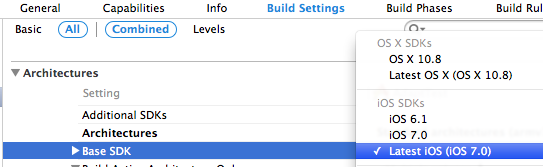

iOS 7 和 xcode 5 发布也有一段时间了，各种程序也已经开始做ios7的适配了，这也是挺头疼的一件事，Statuebar 的20px 就让人蛋疼无比，请允许我做一个悲伤的表情。。。

之前的程序为了做20个像素比较蛋疼，并不是一两句代码可以搞定的。Stack overflow 上有一些适配这20像素的方法，感觉不够优雅，会有很多问题。还好苹果留了一手，其实最简单是适配就是不做适配。。。 索性不折腾，直接用ios6的SDK编译，在iOS7的机器下还保持iOS6的样式，键盘，UIPickerview都是iOS6的样式。但是UIAlertView变成新的样式了，在上面做的Hack就会出现问题，这不是本文的重点，略过略过。

更新xcode 5之后 只有7.0的sdk了，要像用6.1的SDK，可以将之前备份的6.1的sdk拷贝的Xcode的SDK指定目录下

```
/Applications/Xcode.app/Contents/Developer/Platforms/iPhoneOS.platform/Developer/SDKs/iPhoneOS6.1.sdk 
```

我的备份SDK6.1[传送门](http://pan.baidu.com/s/1jAVfn)

因为有2份sdk 真机调试时xcode5会出现2台设备供你选择(其实只连接了一台)， 一台6.1对应的 一台7.0对应的


（顺序可能是并不是严格按照6.1和7.1的顺序排的，以上截图是我自己MAC的截图，公司的，6.1和7.0刚好是反的，23333，只是为了说明有一台iOS设备对应Xcode中2台机器，请无视顺序。）

若你的Base SDK选了7.0 选第一台设备你是编译不过的，然后将target中的base SDK改成6.1，打包ipa。



-以上-