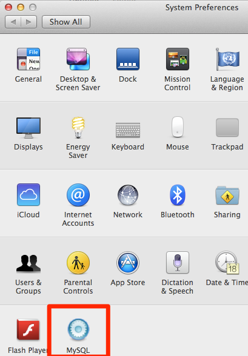
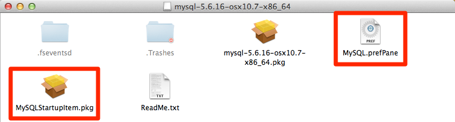
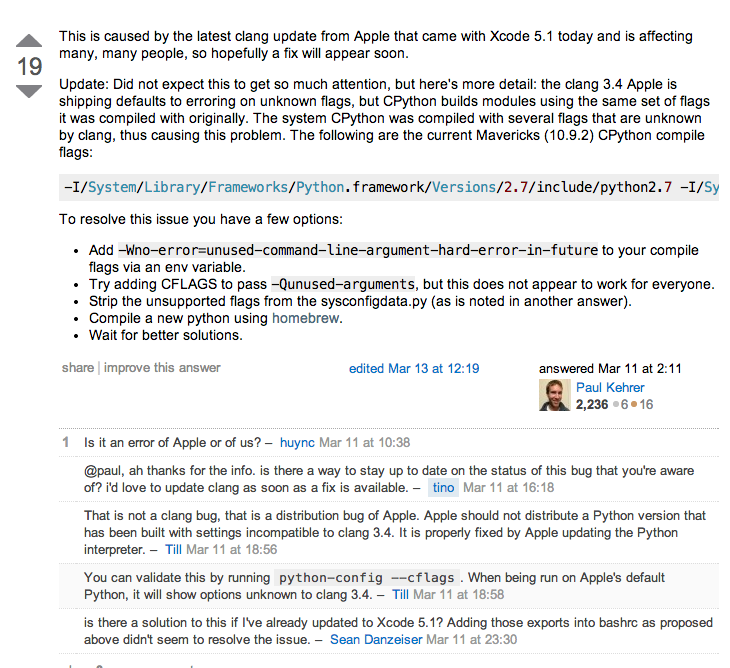

终于解决`MySQLdb`模块的安装了，坑了我快2天了。好吧，又坑了一天（0317）。'Python MySQLdb'各种坑，google后发现被坑的人不在少数，跨平台也不是这么好跨的。

###1.MAMP的MySQL不支持

[MAMP](http://www.mamp.info/)一款Mac上功能强大的App，直接集成了apache-php-mysql，省去了安装的麻烦。MAMP pro 有14天试用期，MAMP是免费的。  

但是遇到的问题MAMP的MySQL被阉割，部分文件找不到，编译MySQLdb1.2.4失败。  
[MAMP下MySQLdb编译不过解决办法](http://dreamconception.com/tech/how-to-install-mysqldb-mysql-python-on-mamp/)未尝试，嫌麻烦就没折腾了。

然后从官网下了[MySQL](http://dev.mysql.com/downloads/mysql/5.6.html)，最新5.7，下了个5.6的。官网上发现好多Oracle的东西，这是被收购？！

启动MySQL查找MySQL安装路径(或者在安装时记得具体的路径)

```
$ ehco ps -ef | grep -i mysql
-bash: ehco: command not found
Xummer-MacBook-Air:PythonLearning Xummer$ ps -ef | grep -i mysql
    0  1787     1   0 11:11PM ??         0:00.02 /bin/sh /usr/local/mysql/bin/mysqld_safe --datadir=/usr/local/mysql/data --pid-file=/usr/local/mysql/data/Xummer-MacBook-Air.local.pid
   74  1885  1787   0 11:11PM ??         0:09.36 /usr/local/mysql/bin/mysqld --basedir=/usr/local/mysql --datadir=/usr/local/mysql/data --plugin-dir=/usr/local/mysql/lib/plugin --user=mysql --log-error=/usr/local/mysql/data/Xummer-MacBook-Air.local.err --pid-file=/usr/local/mysql/data/Xummer-MacBook-Air.local.pid
  501  2744  2348   0  1:52AM ttys000    0:00.00 grep -i mysql
```
Mac启动和关闭可以很方便的用system preferance中的MySQL选项


记得在安装时MySQL时安装[MySQLStarupItem.pkg和MySQL.prefPane](http://dev.mysql.com/doc/refman/5.1/en/macosx-installation-prefpane.html)


然后把路径导入环境

```
$ echo 'export PATH=/usr/local/mysql/bin/:$PATH' >> ~/.bash_profile
```
然后重开个terminal就能使用mysql之类的命令了。

```
$ which mysql
/usr/local/mysql/bin/mysql
```

###2.XCode5.1 clang升级了导致编译参数变化
```
clang: error: unknown argument: '-mno-fused-madd' [-Wunused-command-line-argument-hard-error-in-future]
clang: note: this will be a hard error (cannot be downgraded to a warning) in the future
```
`-mno-fused-madd`是gcc的参数，升级的后clang没有... （MySQLdb1.2.5版本, python 2.7.5）

```
$ cc --version
Apple LLVM version 5.1 (clang-503.0.38) (based on LLVM 3.4svn)
Target: x86_64-apple-darwin13.1.0
Thread model: posix

$ gcc --version
Configured with: --prefix=/Applications/Xcode.app/Contents/Developer/usr --with-gxx-include-dir=/usr/include/c++/4.2.1
Apple LLVM version 5.1 (clang-503.0.38) (based on LLVM 3.4svn)
Target: x86_64-apple-darwin13.1.0
Thread model: posix
```

两个环境

```
MBA
OSX 10.9.2
Xcode 5.1
Apple LLVM version 5.1 (clang-503.0.38) (based on LLVM 3.4svn)
Python 2.7.3
MySQLdb1.2.4 
```
MBA编译一次过，没有出现`-mno-fused-madd`问题。

```
Mac mini
OSX 10.9.2
Xcode 5.1
Apple LLVM version 5.1 (clang-503.0.38) (based on LLVM 3.4svn)
Python 2.7.5
MySQLdb1.2.4 
```
Mac mini一直报错 

```
clang: error: unknown argument: '-mno-fused-madd' [-Wunused-command-line-argument-hard-error-in-future]
```

除了换cc这种脏的做法，暂时无解。

下面的两种方法，都无法解决。

```
$ ARCHFLAGS=-Wno-error=unused-command-line-argument-hard-error-in-future python setup.py install
```

```
$ export CFLAGS=-Qunused-arguments
$ export CPPFLAGS=-Qunused-arguments
```



###3.dylib未找到

后来才发现有[很具体的安装和问题的解决文章](http://blog.chinaunix.net/uid-8487640-id-3183185.html)和[SO上更全面的英文版](http://stackoverflow.com/questions/1448429/how-to-install-mysqldb-python-data-access-library-to-mysql-on-mac-os-x)，大部分问题上面都有清楚的解释。

>可能碰到的问题  
1）问题：ImportError: libmysqlclient_r.so.16: cannot open shared object file: No such file or directory  
原因是python无法找到mysql目录下的libmysqlclient_r.so.16动态库,其实MySQLdb是调用mysql的c函数库.所以本机上首先得安装了mysql  
然后: export LD_LIBRARY_PATH=/usr/local/mysql/lib/mysql:$LD_LIBRARY_PATH  
并且将/usr/local/mysql5.1/lib/mysql 放入/etc/ld.so.conf中  
/etc/ld.so.conf改后内容为：  
include ld.so.conf.d/*.conf  
/usr/local/mysql5.1/lib/mysql

这部分没大看懂，应该是按照某个版本linux来做的，Mac上没找到ls.so.conf这文件。

编译完之后，具体调用时又遇到的问题

```
$ python mysql_connect.py 
Traceback (most recent call last):
  File "mysql_connect.py", line 5, in <module>
    import MySQLdb
  File "/Library/Frameworks/Python.framework/Versions/2.7/lib/python2.7/site-packages/MySQL_python-1.2.4-py2.7-macosx-10.6-intel.egg/MySQLdb/__init__.py", line 19, in <module>
    import _mysql
ImportError: dlopen(/Library/Frameworks/Python.framework/Versions/2.7/lib/python2.7/site-packages/MySQL_python-1.2.4-py2.7-macosx-10.6-intel.egg/_mysql.so, 2): Library not loaded: libmysqlclient.18.dylib
  Referenced from: /Library/Frameworks/Python.framework/Versions/2.7/lib/python2.7/site-packages/MySQL_python-1.2.4-py2.7-macosx-10.6-intel.egg/_mysql.so
  Reason: image not found
```

[SO](http://stackoverflow.com/questions/6383310/python-mysqldb-library-not-loaded-libmysqlclient-18-dylib)上找到的解决办法。

原因也是和上面文章解释的一样，找不到动态链接库 `libmysqlclient.18.dylib`。
建立个软连接就解决了。

```
$ sudo ln -s /usr/local/mysql/lib/libmysqlclient.18.dylib /usr/lib/libmysqlclient.18.dylib
```

###4.Debian上遇到的问题
首先是`mysql_config`找不到，需要安装`libmysqlclient15-dev`

```
sudo apt-get install libmysqlclient15-dev
```

```
sudo dpkg -L libmysqlclient-dev|grep config #查看libmysqlclient-dev包下的带有config的文件
```
之后是报这个错

```
...
running build_ext
building '_mysql' extension
creating build/temp.linux-i686-2.7
gcc -pthread -fno-strict-aliasing -DNDEBUG -g -fwrapv -O2 -Wall -Wstrict-prototypes -fPIC -Dversion_info=(1,2,4,'final',1) -D__version__=1.2.4 -I/usr/include/mysql -I/usr/include/python2.7 -c _mysql.c -o build/temp.linux-i686-2.7/_mysql.o -DBIG_JOINS=1 -fno-strict-aliasing -g
_mysql.c:29:20: fatal error: Python.h: No such file or directory
compilation terminated.
error: command 'gcc' failed with exit status 1
```

怀疑是`python-dev`未安装，[SO](http://stackoverflow.com/questions/7475223/mysql-config-not-found-when-installing-mysqldb-python-interface)

```
sudo apt-get install python-dev 
```

安装完后执行

```
sudo python setup.py install  
```
发现还真是这个问题，Nice!

```
...
Installed /usr/local/lib/python2.7/dist-packages/MySQL_python-1.2.4-py2.7-linux-i686.egg
Processing dependencies for MySQL-python==1.2.4
Finished processing dependencies for MySQL-python==1.2.4
```

-以上-
