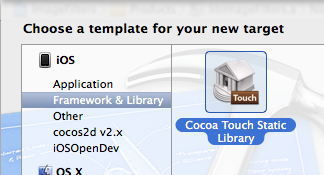
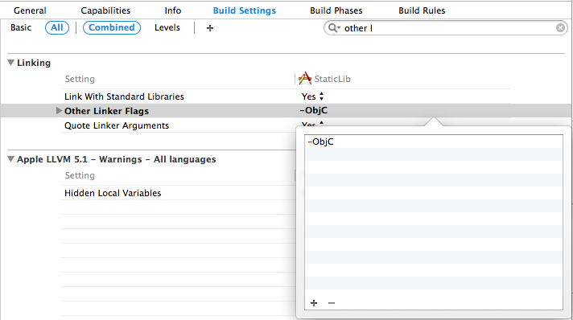

## 创建 Static library
英文好的直接可以看这两个  
[Apple 官方文档](https://developer.apple.com/library/ios/technotes/iOSStaticLibraries/Articles/creating.html)  
[Raywenderlich 教程（貌似被 和™谐 了）](http://www.raywenderlich.com/41377/creating-a-static-library-in-ios-tutorial)

### 创建新的 Lib Target




选 `Cocoa Touch Static` 一路 next


创建好之后, 你会有 2 个由 Xcode 自动生成的文件在新的 target 中, `ImageFilters.h` 和 `ImageFilters.m`, 不需要的话直接删掉就好。    

然后按照下图的要求把文件文件添加到 `Build Phases` 的子项下

* 需要编译的 ` .m ` 文件加到 `Compile Sources`
* 需要被其他工程include的 ` .h ` 文件加到 `Copy Files`


##### 编译标记

>`非arc` 的 ` .m ` 加入到 `arc` 中  
`-fno-objc-arc`

>`arc` 的 ` .m ` 加入到 `非arc` 中  
`-fobjc-arc`


### 更简单的方式创建 Universal Lib

#### 编译目标架构
Static library 是编译后的文件的打包，在编译时，需要选择目标[芯片类型](http://www.yidianzixun.com/article/news_eaf23f7ff41d4862ecbf0d10441cf5f5?s=1)（i386, armv6, armv7, armv7s, arm64）, 选定了芯片架构的 lib 只能跑在符合该芯片架构的设备上。如, i386 对应 Intel 的 CPU, 也就是 Xcode 中的 iOS 模拟器。  
`lipo -info` 命令可以查看 ` .a ` 所对应的芯片架构。  
`lipo` 命令可以将多个不同架构的 ` .a ` 文件合成一个, 只需要导入这一个 ` .a ` 就可以跑模拟器和真机。

#### Aggregate Target
Aggregate Target 是用于聚合多个 target 们的 Target, 我们可以用它来生成多个芯片架构的 lib。


添加 run script


添加 universal lib shell 脚本

```
# define output folder environment variable
UNIVERSAL_OUTPUTFOLDER=${BUILD_DIR}/${CONFIGURATION}-universal
 
# Step 1. Build Device and Simulator versions
xcodebuild -target ImageFilters ONLY_ACTIVE_ARCH=NO -configuration ${CONFIGURATION} -sdk iphoneos  BUILD_DIR="${BUILD_DIR}" BUILD_ROOT="${BUILD_ROOT}"
xcodebuild -target ImageFilters -configuration ${CONFIGURATION} -sdk iphonesimulator -arch i386 BUILD_DIR="${BUILD_DIR}" BUILD_ROOT="${BUILD_ROOT}"
 
# make sure the output directory exists
mkdir -p "${UNIVERSAL_OUTPUTFOLDER}"
 
# Step 2. Create universal binary file using lipo
lipo -create -output "${UNIVERSAL_OUTPUTFOLDER}/lib${PROJECT_NAME}.a" "${BUILD_DIR}/${CONFIGURATION}-iphoneos/lib${PROJECT_NAME}.a" "${BUILD_DIR}/${CONFIGURATION}-iphonesimulator/lib${PROJECT_NAME}.a"
 
# Last touch. copy the header files. Just for convenience
cp -R "${BUILD_DIR}/${CONFIGURATION}-iphoneos/include" "${UNIVERSAL_OUTPUTFOLDER}/"
```

执行完后，点新生成的 .a 文件 Show in Finder，可以看到多了个文件夹 Debug-universal，下面有一个合并好的 fat lib（导入到其他工程中的 ` .a `）


## 创建 bundle
用于存放图片资源以及 nib（xib）文件。

只有 Mac 下有 bundle


新建一个会多一些 Mac 的类库，删除就好


把需要的资源文件加到 bundle 的 `Copy Files` 中。

如果 `nib` 中有引用图片的，默认是在和 `nib` 同一个 `bundle` 下找。

[IB 或代码设置读取其他 `bundle` 的图片](http://stackoverflow.com/questions/7733565/ios-how-to-use-images-in-custom-bundle-in-interface-builder)

```
myImageView.image = [UIImage imageNamed:@"MyBundle.bundle/picture1.png"];
```

## 导入其他工程
把 ` .a ` 文件、需要被导入的头文件 ` .h ` 以及 `bundle` 文件拖到需要导入的工程中  
  

检查下 ` .a ` 文件是否存在于 `Link Binary With Libarries`, 不存在的话手动添加(Xcode 5.1 拖进去自动添加)  


检查下 `bundle` 文件是否存在于 `Copy Bundle Resources`, 同样，不存在的话手动添加   


### xxx.h not found
头文件找不到，添加 `header search path`


### Category in static library

如果 lib 中有使用 `Category`,在导入其他工程后会报错，找不到 `Category` 的方法。

```
+[UIImage libImageNamed:]: unrecognized selector sent to class 0x3982df88
```

添加 `Other Linker Flags`: `-ObjC`



`-ObjC` 具体表示的含义 -来自 [SO](http://stackoverflow.com/questions/2567498/objective-c-categories-in-static-library)

>`-all_load` Loads all members of static archive libraries.

>`-ObjC` Loads all members of static archive libraries that implement an Objective-C class or category.

>`-force_load (path_to_archive)` Loads all members of the specified static archive library. Note: -all_load forces all members of all archives to be loaded. This option allows you to target a specific archive.

几个好用的 `category`
[UIImage+bundle](https://github.com/AliSoftware/Xcode-Utils/blob/master/LibraryWithRsrc/Demo/Demo2Lib/Classes/UIImage%2BBundle.m)

-以上-
