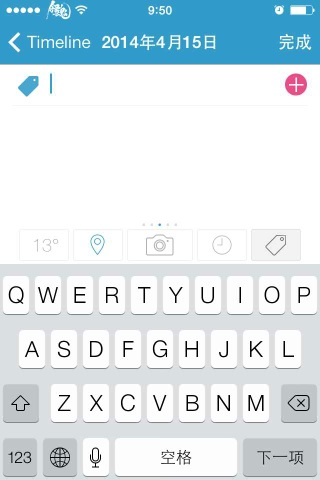

在`UITextView`中加`UITextField`，若不做任何处理，`UITextField`成为`firstResponder`后会移动到中间。

之前

点击`UITextField`以后

发现DayOne也有这样的结构，

用reveal查看DayOne后发现它在`TextField`下面加了一层`UIScrollView`, 问题解决。

以下只是几种情况的猜测  
1. `UITextField`在`becomeFirstResponder`时传递某个消息S到`UITextView`.`UITextView`有处理这个消息S，把`firstResponder`的`UITextField`往`SuperView`递归查找到的第一个`UIScrollView`或`UIScrollView`子类化的`viewA`, 重设`viewA`的`contentOffset`  
2. `UITextView`监听键盘事件，获取`firstResponder`，然后发送全局的消息S（`NSNotificationCenter`, 之后和1一样

-以上-
